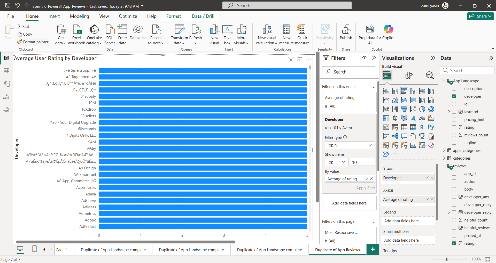
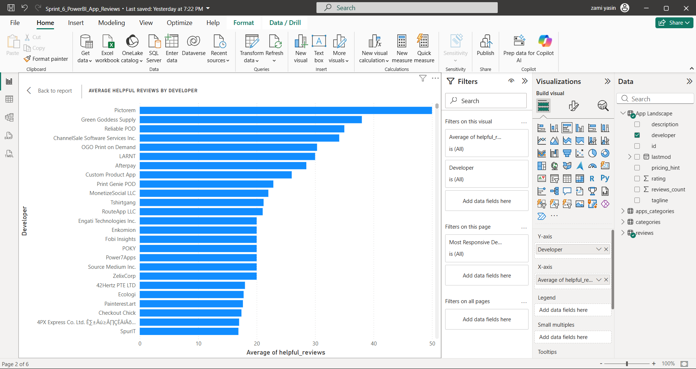
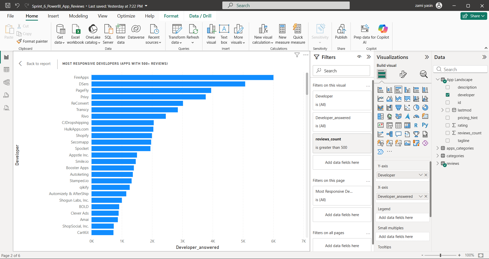
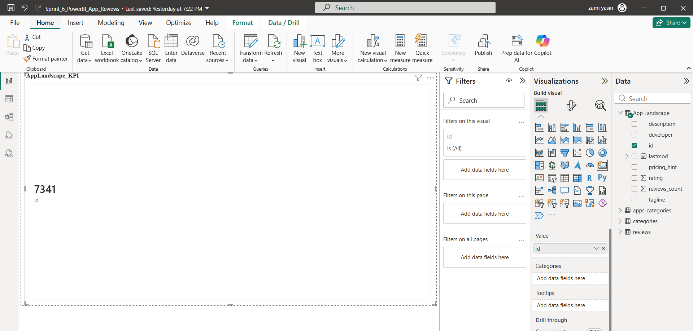

# 📱 App Landscape & Review Analysis

## Overview

This project analyzes app store performance data to understand rating trends, developer responsiveness, and customer review behavior.  

The objective was to identify drivers of app performance and provide actionable insights to improve user satisfaction and platform engagement.

## 🛠 Tools Used

- SQL (Aggregations, Joins, Data Cleaning)
- Power BI (DAX, KPI Cards, Interactive Dashboards)
- Excel (Data Preparation & Validation)
- Data Cleaning & Transformation
---

## 📊 Key Business Questions

- Do developers who respond to reviews have higher average ratings?
- Is there a relationship between helpfulness score and review sentiment?
- Which app segments are underperforming?

---

## 🔍 Key Insights

- Apps with higher developer response rates showed stronger average ratings.
- Helpfulness score positively correlated with review sentiment.
- Certain app categories consistently underperformed in ratings.
- Developer engagement improves customer trust and platform reputation.

---

## 📈 Business Impact

Delivered data-driven recommendations to improve platform engagement and user satisfaction.

- Identified link between developer responsiveness and higher app ratings
- Highlighted underperforming categories for strategic improvement
- Provided insights to improve review engagement and customer trust

## 📸 Dashboard Previews

---
